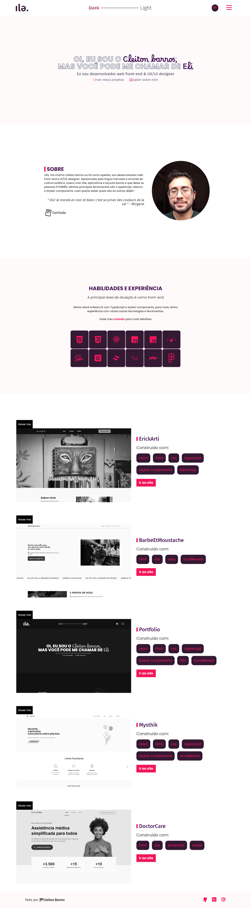
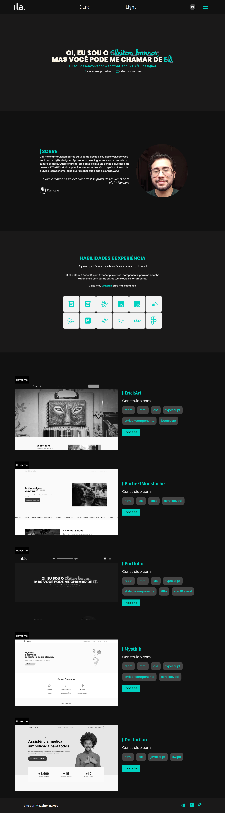

  

<h1 align="center">
  
</h1>

<h1 align="center">
  
</h1>

### Built With

* [![React][React.js]][React-url]
* ![Typescript]
* ![HTML]
* ![CSS]
* ![STYLED]
* [i18next](https://www.i18next.com/)
* [hamburger-react](https://hamburger-react.netlify.app/)
* [animate.css](https://animate.style/)
* [react-icons](https://react-icons.github.io/react-icons)
* [phosphor-icons](https://phosphoricons.com/)
  

## Contact

Eli Barros - [Linkedin](https://www.linkedin.com/in/cleitonbarrosmoura/)

Project Link: [Portfolio](https://cleitonfrontendengineer.vercel.app/)

## License

Distributed under the MIT License. See `[LICENSE.txt]` for more information.

[React.js]: https://img.shields.io/badge/React-20232A?style=for-the-badge&logo=react&logoColor=61DAFB
[React-url]: https://reactjs.org/

[HTML]: https://img.shields.io/badge/HTML5-E34F26?style=for-the-badge&logo=html5&logoColor=white
[CSS]: https://img.shields.io/badge/CSS3-1572B6?style=for-the-badge&logo=css3&logoColor=white

[Bootstrap.com]: https://img.shields.io/badge/Bootstrap-563D7C?style=for-the-badge&logo=bootstrap&logoColor=white
[Bootstrap-url]: https://getbootstrap.com

[Typescript]: https://img.shields.io/badge/TypeScript-007ACC?style=for-the-badge&logo=typescript&logoColor=white
[STYLED]: https://img.shields.io/badge/styled--components-DB7093?style=for-the-badge&logo=styled-components&logoColor=white

